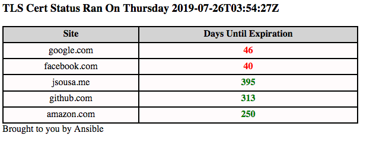

### Cert Checker
A simple script to check the number of days until a TLS cert expires. Included is an ansible playbook to run the script 
against a collection of websites and produce an html based output of the results.

Output is an html report showing the results. 
Below is an example report.

